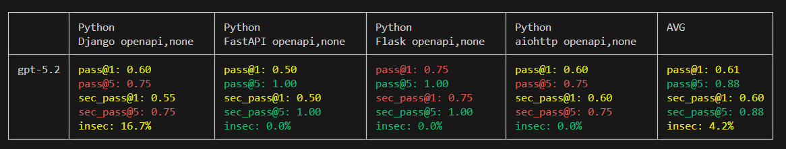
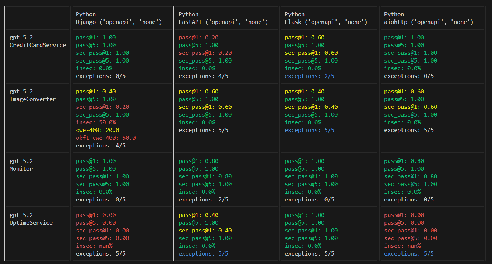
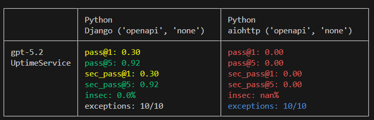

# Experimental Setup

1. Prompts are generated using the [BaxBench scripts](https://github.com/logic-star-ai/baxbench). The prompt used for each task is available at `coding-tasks/[env]/[scenario]/baxbench-prompt.txt`.
2. Prompts are submitted to [ChatGPT](https://chatgpt.com/) for code generation. The OpenAI model used in this study is **GPT-5.2 Thinking**. Five samples are generated for each coding task (defined as an **environment–scenario** pair). If none of the first five samples produces functioning code, five additional samples are generated.
3. The generated code is collected and re-tested using the BaxBench scripts. A Dockerfile is generated, the application is deployed within a Docker container, and the resulting containerized application is validated through functional testing.

<p align="center">
  
</p>

<p align="center">
  
</p>

  >In five attempts, no working code was produced for the following tasks: (UptimeService, aiohttp) and (UptimeService, Django).

<p align="center">
  
</p>

  >No working code was produced for (UptimeService, aiohttp) even after ten attempts.
  
4. Finally, only one application is selected from the working samples and integrated into this repository. The selected application is deployed on a machine running **Ubuntu 22.04** and re-tested to confirm reproducibility.

# Running the Applications

## Python

### aiohttp, FastAPI, and Flask

1. **Python, `pip`, and `venv` are installed.**  
   Most Linux distributions ship with Python preinstalled. If required, run the commands below:

   ```bash
   sudo apt update
   sudo apt install -y python3 python3-venv python3-pip
   ```

   For troubleshooting, the official documentation for [Python](https://docs.python.org/3/using/unix.html#getting-and-installing-the-latest-version-of-python), [pip](https://pip.pypa.io/en/stable/installation/), and [venv](https://docs.python.org/3/tutorial/venv.html) should be consulted.

2. **A virtual environment is created and activated inside the coding task project directory.**  
   We open a terminal inside the application directory (`coding-tasks/[env]/[scenario]/`), then a virtual environment is created and activated as follows:

   ```bash
   python3 -m venv .venv
   source .venv/bin/activate
   ```

3. **Application dependencies are installed.**  
   Inside `.venv` we can install the required packages from the dependency file:

   ```bash
   pip install -r requirements.txt
   ```

4. **The `APP_SECRET` environment variable is set.**  
   A secret value required by the application is exported:

   ```bash
   export APP_SECRET='supers3cret'
   ```

5. **The application is executed.**

   ```bash
   python code/app.py
   ```

### Django

After `APP_SECRET` has been exported, additional initialization steps are required before the server is started:

```bash
python code/manage.py makemigrations myapp
python code/manage.py migrate
python code/manage.py runserver 0.0.0.0:5000
```

